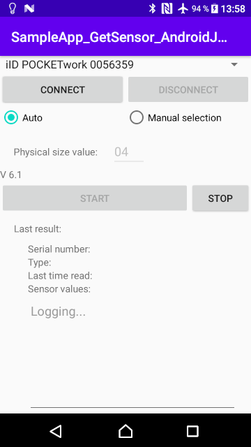

# samples-doc_telidtransponders_android / Android DOC sample code for TELID®200 sensor transponders
This sample code is for handling **TELID®200** sensor transponders on Android devices using a Micro-Sensys RFID reader

> For details on DOC communication check [Useful Links](#Useful-Links) 

## Requirements
* Android Studio
* Android device to debug/deploy the sample code. You will need one of the following:
	* Any Android device with Bluetooth, to use one of our Bluetooth RFID reader
	* One of our supported industry Android devices, to use one of our RFID reader modules
* Micro-Sensys RFID reader (either Bluetooth or module)
* TELID®200 sensor transponders

## Implementation
This code shows how to use **RFIDFunctions_3000** class to communicate with a TELID®200 sensor transponder. 
Using this class the communication port can be open/closed. Once the communication with RFID reader is established, a Thread can be started to cyclically search for TELID®200 and read current measurement value.

> Class information is available under API documentation. See [Useful Links](#Useful-Links)

## Steps
Just import this project into Android Studio, connect the Android device to your computer and deploy the SampleApp.
If you have a iID®PENsolid or iID®POCKETwork paired over Bluetooth to the device, it will automatically list the devices in the Spinner. 

 1. Select the device you wish to connect to, and press CONNECT. Once the connect process finishes, the result will be shown in the EditText on the bottom side, and if the device is connected, the START button will be enabled.
 2. Use *START* button to start the read Thread. The library will automatically detect the TELID® type and show the measurements

## Useful Links

* [AAR Library and API documentation](https://www.microsensys.de/downloads/DevSamples/Libraries/Android/microsensysRFID%20-%20aar%20library/)
* Check what is possible using our iID®DEMOsoft (section SENSORdemo) for PC! Download it using [this link](https://www.microsensys.de/downloads/CDContent/Install/iID%c2%ae%20DEMOsoft.zip)
* GitHub *doc* repository: [Micro-Sensys/doc](https://github.com/Micro-Sensys/doc)
	* [communication-modes/doc](https://github.com/Micro-Sensys/doc/tree/master/communication-modes/doc)

## Contact

* For coding questions or questions about this sample code, you can use [support@microsensys.de](mailto:support@microsensys.de)
* For general questions about the company or our devices, you can contact us using [info@microsensys.de](mailto:info@microsensys.de)

## Authors

* **Victor Garcia** - *Initial work* - [MICS-VGarcia](https://github.com/MICS-VGarcia/)
